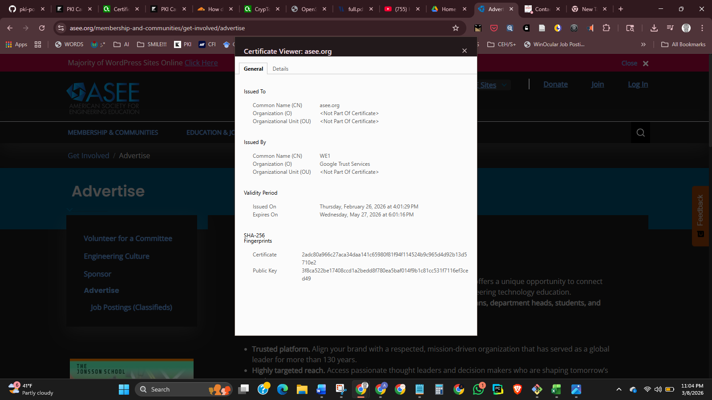

# Week 01 Lab — Certificate Inspection

## Screenshot Evidence

1. Capture a screenshot of the certificate details in your browser.
2. Save it as:

assets/screenshots/week-01/certificate-inspection.png

3. Embed the screenshot below:

## Website Information

**Website inspected:**  
https://www.asee.org

**Issuer (Certificate Authority):**  
Common Name (CN)	WE1

**Valid from:**  
Thursday, February 26, 2026 at 4:01:29 PM

**Valid until:**  
Wednesday, May 27, 2026 at 6:01:16 PM

**Signature algorithm:**  
Certificate	2adc80a966c27aca34daa141c65980f81f94f114524b9c965d4d92b13d5710e2
Public Key	3f8ca522be17408ccd1a2bedd8f780ea5baf014f9b1c81cc531f7116ef3ced49
---

## Subject Alternative Names (SAN Entries)

List at least 2–3 SAN entries:

- 
- 
- 

---

## Observations

Document three observations about the certificate.

### Observation 1
Not finding the Subject Alternative Name is what stood out the most.

### Observation 2
I ran www.asee.org against Qualys SSL Labs to dig further into where their SANS could be found.

Results:
Certificate #1: RSA 2048 bits (SHA256withRSA)

Server Key and Certificate #1
Subject	asee.org
Fingerprint SHA256: 7359686c45efe0be48992f2397d2425827911aeb3a1b71432d8c20ec63a03666
Pin SHA256: /Xrr7IuC6JRsls6++zaPi7GMESy0robbPTVG5LVTuLU=
Common names	asee.org
Alternative names	asee.org *.asee.org
Serial Number	00c5713b6762bb66a013d78830ba55567f
Valid from	Fri, 27 Feb 2026 00:01:10 UTC
Valid until	Thu, 28 May 2026 00:58:31 UTC (expires in 2 months and 18 days)
Key	RSA 2048 bits (e 65537)
Weak key (Debian)	No
Issuer	WR1
AIA: http://i.pki.goog/wr1.crt
Signature algorithm	SHA256withRSA
Extended Validation	No
Certificate Transparency	Yes (certificate)
OCSP Must Staple	No
Revocation information	CRL, OCSP
CRL: http://c.pki.goog/wr1/Ap04vJ05CyA.crl
OCSP: http://o.pki.goog/s/wr1/xXE
Revocation status	Good (not revoked)
DNS CAA	No (more info)
Trusted	Yes
Mozilla  Apple  Android  Java  Windows 

Additional Certificates (if supplied)
Certificates provided	3 (4000 bytes)
Chain issues	None
#2
Subject	WR1
Fingerprint SHA256: b10b6f00e609509e8700f6d34687a2bfce38ea05a8fdf1cdc40c3a2a0d0d0e45
Pin SHA256: yDu9og255NN5GEf+Bwa9rTrqFQ0EydZ0r1FCh9TdAW4=
Valid until	Tue, 20 Feb 2029 14:00:00 UTC (expires in 2 years and 11 months)
Key	RSA 2048 bits (e 65537)
Issuer	GTS Root R1
Signature algorithm	SHA256withRSA
#3
Subject	GTS Root R1
Fingerprint SHA256: 3ee0278df71fa3c125c4cd487f01d774694e6fc57e0cd94c24efd769133918e5
Pin SHA256: hxqRlPTu1bMS/0DITB1SSu0vd4u/8l8TjPgfaAp63Gc=
Valid until	Fri, 28 Jan 2028 00:00:42 UTC (expires in 1 year and 10 months)
Key	RSA 4096 bits (e 65537)
Issuer	GlobalSign Root CA
Signature algorithm	SHA256withRSA

Hide Certification Paths
Certification Paths
MozillaAppleAndroidJavaWindows
Path #1: Trusted
1	Sent by server	asee.org
Fingerprint SHA256: 7359686c45efe0be48992f2397d2425827911aeb3a1b71432d8c20ec63a03666
Pin SHA256: /Xrr7IuC6JRsls6++zaPi7GMESy0robbPTVG5LVTuLU=
RSA 2048 bits (e 65537) / SHA256withRSA
2	Sent by server	WR1
Fingerprint SHA256: b10b6f00e609509e8700f6d34687a2bfce38ea05a8fdf1cdc40c3a2a0d0d0e45
Pin SHA256: yDu9og255NN5GEf+Bwa9rTrqFQ0EydZ0r1FCh9TdAW4=
RSA 2048 bits (e 65537) / SHA256withRSA
3	In trust store	GTS Root R1   Self-signed
Fingerprint SHA256: d947432abde7b7fa90fc2e6b59101b1280e0e1c7e4e40fa3c6887fff57a7f4cf
Pin SHA256: hxqRlPTu1bMS/0DITB1SSu0vd4u/8l8TjPgfaAp63Gc=
RSA 4096 bits (e 65537) / SHA384withRSA
Path #2: Trusted
1	Sent by server	asee.org
Fingerprint SHA256: 7359686c45efe0be48992f2397d2425827911aeb3a1b71432d8c20ec63a03666
Pin SHA256: /Xrr7IuC6JRsls6++zaPi7GMESy0robbPTVG5LVTuLU=
RSA 2048 bits (e 65537) / SHA256withRSA
2	Sent by server	WR1
Fingerprint SHA256: b10b6f00e609509e8700f6d34687a2bfce38ea05a8fdf1cdc40c3a2a0d0d0e45
Pin SHA256: yDu9og255NN5GEf+Bwa9rTrqFQ0EydZ0r1FCh9TdAW4=
RSA 2048 bits (e 65537) / SHA256withRSA
3	Sent by server	GTS Root R1
Fingerprint SHA256: 3ee0278df71fa3c125c4cd487f01d774694e6fc57e0cd94c24efd769133918e5
Pin SHA256: hxqRlPTu1bMS/0DITB1SSu0vd4u/8l8TjPgfaAp63Gc=
RSA 4096 bits (e 65537) / SHA256withRSA
4	In trust store	GlobalSign Root CA   Self-signed
Fingerprint SHA256: ebd41040e4bb3ec742c9e381d31ef2a41a48b6685c96e7cef3c1df6cd4331c99
Pin SHA256: K87oWBWM9UZfyddvDfoxL+8lpNyoUB2ptGtn0fv6G2Q=
RSA 2048 bits (e 65537) / SHA1withRSA
Weak or insecure signature, but no impact on root certificate

Extending Certificate #1 and analyzing the certificate path did not provide any results for Subject Alternative Name.

### Observation 3
<!-- What did you notice? -->
 I noticed the SSL Report:
 SSL Report: www.asee.org
-labeled the alternative names as 	asee.org *.asee.org
---

## Reflection

Based on your inspection, explain how this certificate contributes to secure HTTPS communication.
Asee.org reported their HTTPS secure communication as follows:
HTTP Requests
1 https://www.asee.org/  (HTTP/1.1 200 OK)
1
Date	Mon, 09 Mar 2026 06:26:42 GMT
Content-Type	text/html; charset=utf-8
Transfer-Encoding	chunked
Connection	close
Server	cloudflare
Cache-Control	private
Set-Cookie	ARRAffinity=9e48c3f34ebef35a3aa3536b7401cfbfda9d2ccd602455b52970d31acb62bf91;Path=/;HttpOnly;Secure;Domain=www.asee.org
Set-Cookie	ARRAffinitySameSite=9e48c3f34ebef35a3aa3536b7401cfbfda9d2ccd602455b52970d31acb62bf91;Path=/;HttpOnly;SameSite=None;Secure;Domain=www.asee.org
Vary	Accept-Encoding
X-AspNetMvc-Version	5.2
X-AspNet-Version	4.0.30319
X-UA-Compatible	IE=Edge
cf-cache-status	DYNAMIC
CF-RAY	9d98026d39891b4b-PHX

In comparison to jpmorganchase.com, their certificate, labeled plainly Certificate Subject Alternative Name, contained the following:
Not Critical
DNS Name: cws-main-akamai.jpmorgan.com
DNS Name: www.jpm.com
DNS Name: www.jpmorgan.com
DNS Name: www.jpmorganchase.com

In addition, JP Morgan demands more security than Asee.org.

HTTP Requests
1 https://www.jpmorganchase.com/  (HTTP/1.1 200 OK)
1
x-content-type-options	nosniff
Content-Type	text/html;charset=utf-8
x-frame-options	SAMEORIGIN
x-content-type-options	nosniff
Last-Modified	Fri, 06 Mar 2026 15:17:09 GMT
ETag	"1b108-64c5c8bfffd3e"
p3p	CP="NON CURa ADMa DEVa TAIa IVAa OUR DELa SAMa LEG UNI PRE"
x-xss-protection	1; mode=block
Content-Security-Policy	frame-ancestors 'self'
X-Akamai-Transformed	9l 22546 0 pmb=mRUM,2
Expires	Mon, 09 Mar 2026 06:41:37 GMT
Cache-Control	max-age=0, no-cache
Pragma	no-cache
Date	Mon, 09 Mar 2026 06:41:37 GMT
Transfer-Encoding	chunked
Connection	close
Connection	Transfer-Encoding
Set-Cookie	geo_country=US; secure
Set-Cookie	geo_region=AZ; secure
Server-Timing	cdn-cache; desc=HIT
Server-Timing	edge; dur=1
Strict-Transport-Security	max-age=15768000 ; includeSubDomains ; preload
Server-Timing	ak_p; desc="1773038497754_390286890_840616925_51_10012_19_24_-";dur=1

-A secure HTTPS path is labeled and displayed in the repetition of Fingerprint SHA256: b10b6f00e609509e8700f6d34687a2bfce38ea05a8fdf1cdc40c3a2a0d0d0e45
Pin SHA256: yDu9og255NN5GEf+Bwa9rTrqFQ0EydZ0r1FCh9TdAW4=
RSA 2048 bits (e 65537) / SHA256withRSA throughout the certificate path for both Asee.org and jpmorganchase.com
