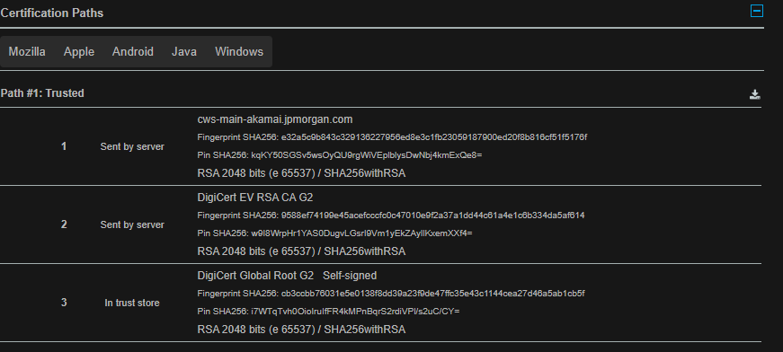

# Week 01 Mini Lab — Trust Chain Validation

## Screenshot Evidence

Capture a screenshot of the Certification Path (certificate chain) from your browser.

Save it as:

assets/screenshots/week-01/trust-chain-validation.png

Embed the screenshot below:

## Website Information

**Website inspected:**  
(https://www.jpmorganchase.com/)

---

## Certificate Chain Breakdown

**Leaf (Server) Certificate**  
cws-main-akamai.jpmorgan.com

**Intermediate Certificate Authority**
DNS Certification Authority Authorization (CAA) Policy found for this domain.
(CAA creates a DNS mechanism that enables domain name owners to whitelist CAs that are allowed to issue certificates for their hostnames. It operates via a new DNS resource record (RR) called CAA (type 257)-https://blog.qualys.com/product-tech/2017/03/13/caa-mandated-by-cabrowser-forum?_ga=2.74040722.1089718678.1773037566-810447417.1773037566)

**Root Certificate Authority (Trust Anchor)**
	DigiCert Global Root G2

---

## Trust Anchor Verification

Is the Root CA marked as trusted by your system?

<!-- Yes / No -->

If yes, explain where that trust comes from (OS/browser root store).
Trusted	- Yes
Coming from:
Mozilla  Apple  Android  Java  Windows 

If no, explain what warning or behavior occurred.

---

## Observations

Document three observations about the certificate.

### Observation 1
I noticed the path took steps beginning at the main domain. Then the server moved it to the CA, where it ended at the trust store, Global Root G2.

### Observation 2
I noticed it was self-signed and followed the CAA policy.

### Observation 3
As for the browser trust jpmorganchase.com utilizes:
Forward Secrecy	Yes (with most browsers) and also identified "This site works only in browsers with SNI support.".
---

## Reflection

In 3–5 sentences, explain:
- Why the Root certificate is called a trust anchor?
- Based on the financial system, the Root certificate added the security of CAA for additional security and removal of any mishaps that could happen on the CA's end.
- 
- How validation walks the certificate chain?
- The details of the validation walk looks like this:
- 1	Sent by server	cws-main-akamai.jpmorgan.com
2	Sent by server	DigiCert EV RSA CA G2
3	In trust store	DigiCert Global Root G2   Self-signed
  
- What would happen if the Root CA were not trusted?
- If the Root CA were not trusted the validation conditions would no longer be evaluated.

Use your own words.
